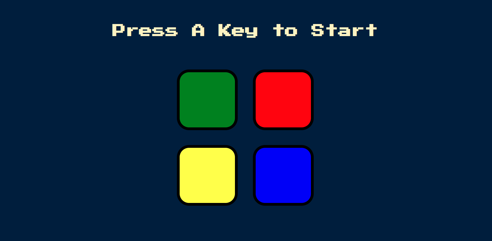
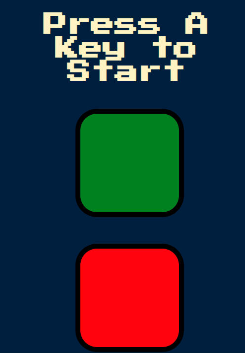
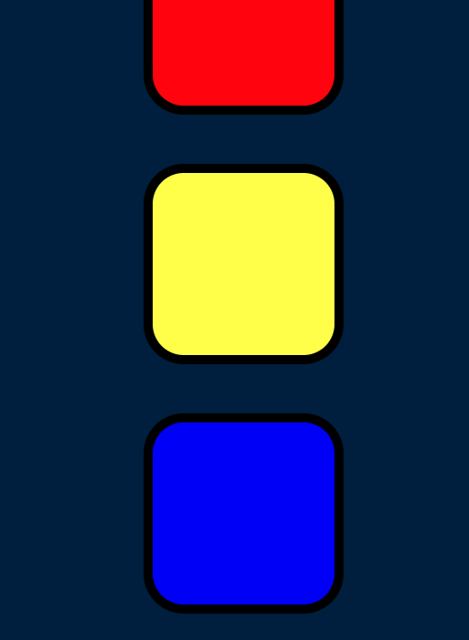

## Overview
- [Overview](The Project "Simon Game")
  - [Screenshot](./images/image1.png)
  - [Links](https://github.com/Pepo946/Simon-Game.git)
- [My process](#my-process)
  - [Built with](Html Css JavaScript Jquery)
  - [What I learned](**i did learn i lots of things such how work with the Jquery and JavaScript and to make css apply to them**   )
  - [Continued development](Now im try to learn more about React )
  - [Useful resources](https://www.w3schools.com/jquery/default.asp)
  - [Useful resources](https://blog.jquery.com/)
- [Author => Pepo]

### Screenshot





### Built with

- Semantic HTML5 markup
- CSS custom properties
- JavaScript properties
- Jquery properties


### What I learned

how to work with Jquery and it was fun time learn it is so easy and make javascript so easy to work with it 

```html
<link rel="icon" href="./images/OIP.66m_SqV5aESg-P0KFtExyQHaEK">
<a href="#title" class="nav-link active" aria-current="page"> + <section id="title">

```

CSS
```css
.btn {
  margin: 25px;
  display: inline-block;
  height: 200px;
  width: 200px;
  border: 10px solid black;
  border-radius: 20%;
}
```
```js
$(document).keypress(function() {
  if (!started) {
    $("#level-title").text("Level " + level);
    nextSequence();
    started = true;
  }
});

$(".btn").click(function() {

  let userChosenColour = $(this).attr("id");
  userClickedPattern.push(userChosenColour);

  playSound(userChosenColour);
  animatePress(userChosenColour);

  checkAnswer(userClickedPattern.length-1);
});

function animatePress(currentColor) {
  $("#" + currentColor).addClass("pressed");
  setTimeout(function () {
    $("#" + currentColor).removeClass("pressed");
  }, 100);
}
```


### Continued development

My future PLans is to be more good in Web-Dev{Using React in next projects}. 

### Useful resources

- [Example resource ](https://www.tutorialrepublic.com/css-tutorial/) - This helped me for design  and with how to manage Div  reason. I really liked this pattern and will use it going forward.


## Author

- LinkDen - [Pepo](https://www.linkedin.com/in/mohamed-gandoul-53a5ba258/)
- Frontend Mentor - [@Pepo946](https://www.frontendmentor.io/profile/Pepo946)
- Twitter - [@Pepo9461](https://www.twitter.com/yourusername)

